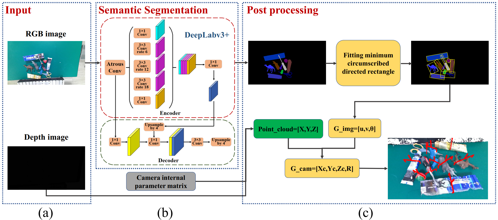

## A Fitting Grasp Detection Network Based on the DeepLabv3+ Semantic Segmentation Model
---

## Principle

## Environment
tensorflow==2.6.0

### Data
dataset: https://graspnet.net/datasets.html

### Training
1. Download the dataset from the above website and modify the data path in the code;
2. Install the library required in requirements.txt;
3. Run train.py to train model

### Prediction
Run pred.py  

### 3D visualization
Run val_cloud.py / val_cloud_expend.py
